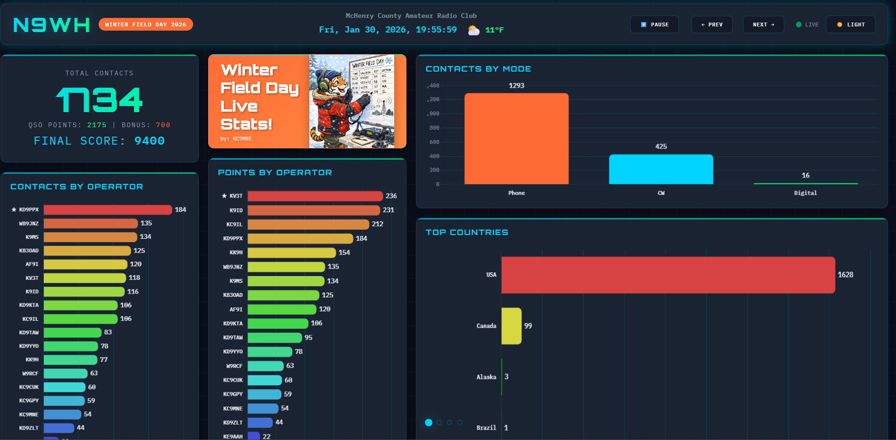
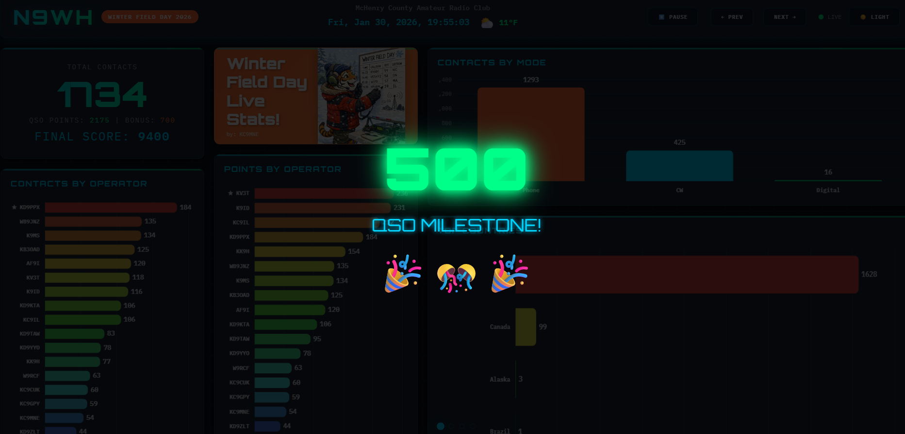
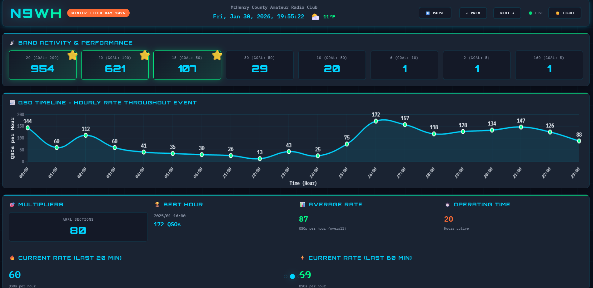
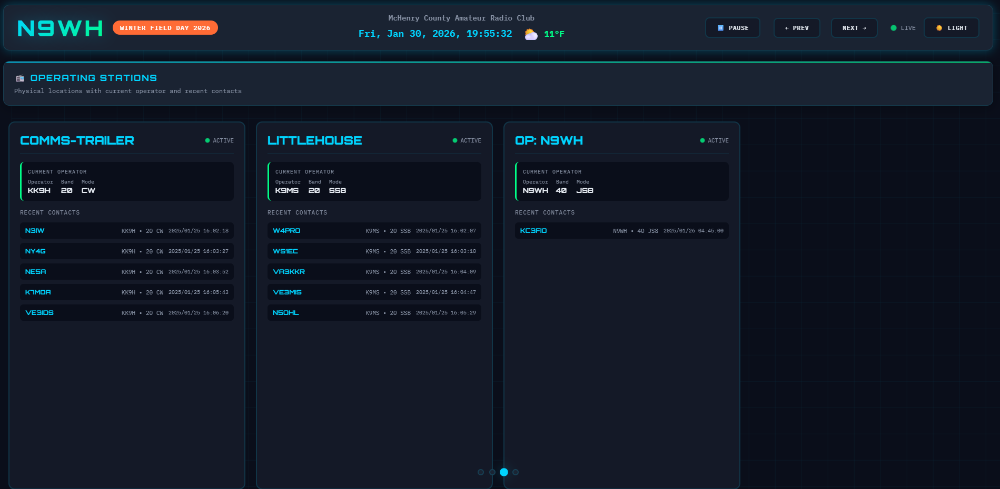
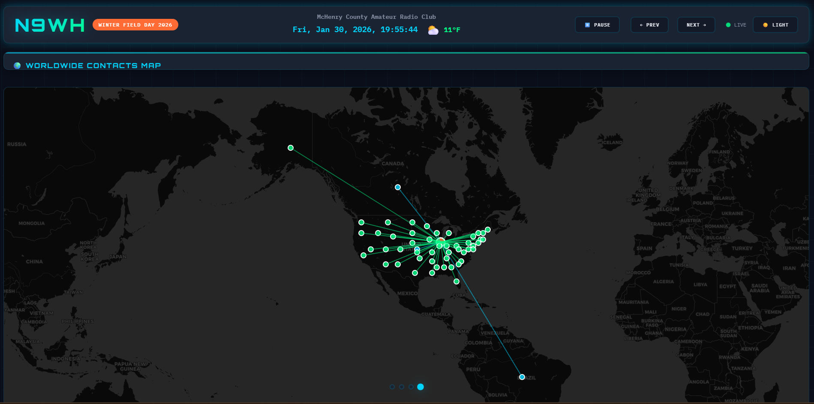

# 📡 N3FJP Field Day Scoreboard

<div align="center">


**A fun, real-time web-based scoreboard for ARRL Field Day events using N3FJP logging software**

[Features](#-features) • [Screenshots](#-screenshots) • [Installation](#-installation) • [Configuration](#-configuration) • [Usage](#-usage)

</div>

---

## 🌟 Overview

Transform your Field Day operation with this techy, real-time scoreboard that connects directly to N3FJP's API. Display live statistics, operator performance, band activity, and worldwide contacts on any screen - from laptops to 4K TVs!

**Built for clubs who want to:**
- 🎯 Engage operators with real-time stats and milestones
- 📊 Track performance across multiple stations
- 🌍 Visualize global reach on an interactive map
- 🏆 Calculate accurate Field Day bonus points
- 🎉 Celebrate achievements with fun animations

---

## ✨ Features

### 📈 Real-Time Statistics
- **Live QSO Counter** - Watch contacts climb in real-time
- **Operator Leaderboards** - Friendly competition tracking
- **Band Activity** - Visual breakdown by frequency
- **Contact Rate Graphs** - Hourly performance metrics
- **Field Day Scoring** - Automatic bonus point calculation

### 🗺️ Interactive World Map
- **Leaflet.js Integration** - Professional mapping with offline support
- **Contact Visualization** - See every state and country worked
- **Distance Lines** - Connections from your QTH to each contact
- **Theme-Aware Tiles** - Matches dark/light mode automatically

### 🎊 Engagement Features
- **Milestone Celebrations** - Animations at 100, 500, 1000+ contacts
- **Band Goal Stars** - Visual rewards when goals are met
- **Fire Effect** - Rates >100 QSOs/hr get special treatment 🔥
- **New Band Alerts** - Celebrate first contact on each band

### 📡 Multi-Station Support
- **Station Cards** - Track each physical operating location
- **Current Operator** - See who's running each station
- **Recent Contacts** - Last 5 QSOs per station
- **Band/Mode Display** - Know what's happening at a glance

### 🎨 Professional Interface
- **4-Page Carousel** - Auto-rotating display (15s intervals)
- **Dark/Light Themes** - Easy on the eyes day or night
- **Manual Navigation** - Pause, prev/next controls
- **Keyboard Shortcuts** - Arrow keys, spacebar, number keys
- **Responsive Design** - Optimized for 1080p displays
- **Live Weather** - Current conditions at your QTH

### 🏆 Field Day Scoring Engine
Fully compliant with ARRL Field Day rules:
- Class multipliers (1A, 2O, etc.)
- Power multipliers (Emergency power = 2x)
- 11 bonus categories (100 pts each)
- NTS message tracking (10 pts each)
- Real-time final score calculation

---

## 📸 Screenshots

### Main Scoreboard - Live Stats & Operator Performance

*Real-time contact counter with QSO points, bonus points, and final Field Day score. Operator leaderboards show both contacts and points earned.*

### Milestone Celebration - Gamification at its Best!

*Full-screen celebrations trigger at major milestones (100, 500, 1000 contacts) and when opening new bands. Keeps operators motivated!*

### Performance Dashboard - Deep Analytics

*Band activity with goal indicators (⭐ stars when goals met), hourly timeline chart, multipliers, best hour, and live rate statistics with fire effect 🔥*

### Multi-Station View - Operation Command Center

*Track multiple physical stations simultaneously. See current operator, band, mode, and last 5 contacts for each location.*

### World Map - Visualize Your Reach

*Leaflet.js powered map shows all countries and states worked. Lines connect your QTH to each contact. Click markers for location names.*

---

## 🚀 Installation

### Prerequisites
- **N3FJP Logging Software** (Any contest logger with API enabled)
- **Python 3.8+**
- **Network connectivity** between scoreboard and N3FJP PC

### Quick Start

1. **Clone the Repository**
```bash
git clone https://github.com/kc9mne/N3FJP-Scoreboard-API.git
cd N3FJP-Scoreboard-API
```

2. **Install Dependencies**
```bash
pip install -r requirements.txt
```

3. **Download Offline Map Support** (one-time setup)
```bash
python download_leaflet.py
```

4. **Configure Your Event** (see [Configuration](#-configuration))
```bash
nano config.json
```

5. **Enable N3FJP API**
- In N3FJP: **Other** → **TCP/IP Interface**
- Check "**Enable TCP/IP Server**"
- Note the port (default: 1100)

6. **Start the Server**
```bash
python -m uvicorn server:app --host 0.0.0.0 --port 8080
```

7. **Open in Browser**
```
http://localhost:8080
```

### Fullscreen Mode (Recommended for TV/Projector)
```bash
# Linux/Raspberry Pi
chromium-browser --kiosk --app=http://localhost:8080

# Windows
chrome.exe --kiosk --app=http://localhost:8080

# macOS
open -a "Google Chrome" --args --kiosk --app=http://localhost:8080
```

---

## ⚙️ Configuration

Edit `config.json` with your event details:

### Basic Setup (Minimum Required)
```json
{
  "n3fjp_host": "127.0.0.1",
  "n3fjp_port": 1100,
  "club_name": "Your Club Name",
  "callsign": "N0CALL",
  "event_name": "Winter Field Day 2026"
}
```

### Full Configuration with All Features
```json
{
  "n3fjp_host": "192.168.1.100",
  "n3fjp_port": 1100,
  "seed_count": 5000,
  "tail_count": 80,
  "refresh_seconds": 3,
  
  "club_name": "Your Amateur Radio Club",
  "callsign": "M3OW",
  "event_name": "Winter Field Day 2026",
  "home_lat": 41.3,
  "home_lon": -88.4,
  "home_location": "McHenry, IL",
  
  "field_day_class": "2O",
  "emergency_power": true,
  "media_publicity": false,
  "public_location": true,
  "public_information_table": true,
  "nts_message_originated": 10,
  "nts_message_handled": 10,
  "satellite_qso": false,
  "w1aw_bulletin": false,
  "educational_activity": false,
  "social_media": true,
  "youth_participation": true,
  "site_visit_official": false,
  
  "weather_enabled": true,
  
  "band_goals": {
    "160": 5,
    "80": 50,
    "40": 100,
    "20": 200,
    "15": 50,
    "10": 50,
    "6": 10,
    "2": 5
  }
}
```

### Configuration Parameters

| Parameter | Type | Description |
|-----------|------|-------------|
| `n3fjp_host` | string | IP address of N3FJP logging PC |
| `n3fjp_port` | int | N3FJP TCP/IP port (default: 1100) |
| `club_name` | string | Your club name (shown in header) |
| `callsign` | string | Event callsign |
| `event_name` | string | Event name (e.g., "Winter Field Day 2026") |
| `home_lat` | float | Latitude for map center and weather |
| `home_lon` | float | Longitude for map center and weather |
| `field_day_class` | string | Station class (1A, 2O, 3A, etc.) |
| `emergency_power` | bool | 100% emergency power bonus (100 pts + 2x mult) |
| `band_goals` | object | Target contacts per band (for star indicators) |
| `weather_enabled` | bool | Show live weather in header |

---

## 💡 Usage

### Keyboard Shortcuts
- **Arrow Left/Right** - Navigate pages
- **Spacebar** - Pause/resume auto-rotation
- **1, 2, 3, 4** - Jump to specific page

### Header Controls
- **⏸️ Pause / ▶️ Play** - Stop/start auto-rotation
- **← Prev | Next →** - Manual page navigation
- **☀️ Light / 🌙 Dark** - Toggle theme

### Page Breakdown
1. **Main Scoreboard** - Total contacts, operator charts, mode breakdown
2. **Performance Stats** - Band activity, timeline, rates, multipliers
3. **Operating Stations** - Multi-station tracking with recent QSOs
4. **World Map** - Geographic visualization of contacts

---

## 🎯 Field Day Scoring

The scoreboard calculates your complete Field Day score in real-time:

### Formula
```
Final Score = (QSO Points × Class Multiplier × Power Multiplier) + Bonus Points
```

### Example Calculation
```
QSO Points: 2,175
Class: 2O (2 transmitters) = ×2
Emergency Power: Yes = ×2
Bonus Points: 700

Final Score = (2,175 × 2 × 2) + 700 = 9,400 points
```

### Bonus Categories (100 pts each)
✅ 100% Emergency Power (also provides 2x multiplier!)  
✅ Media Publicity  
✅ Public Location  
✅ Public Information Table  
✅ NTS Messages (10 pts each, max 100)  
✅ Satellite QSO  
✅ Bulletin Copy  
✅ Educational Activity  
✅ Social Media  
✅ Youth Participation (20% under 18)  
✅ Site Visit by Official  

---

## 🎨 Customization

### Adjust Band Goals
Edit the `band_goals` section to match your expectations:
```json
"band_goals": {
  "20": 300,    // Increase for prime band
  "40": 150,    // Adjust for propagation
  "160": 10     // Set realistic nighttime goal
}
```
Bands meeting their goal get a ⭐ star indicator!

### Change Page Rotation Speed
Edit `index.html` line ~1750:
```javascript
setInterval(nextPage, 15000);  // 15 seconds (15000ms)
```

### Disable Weather
Set `weather_enabled: false` in config.json if no internet

---

## 🛠️ Troubleshooting

### Scoreboard Shows No Data
- ✅ Verify N3FJP TCP/IP interface is enabled
- ✅ Check `n3fjp_host` IP address in config.json
- ✅ Ensure both PCs are on same network
- ✅ Check firewall isn't blocking port 1100
- ✅ Look for errors in terminal where server is running

### Weather Not Showing
- ✅ Verify internet connection
- ✅ Check `home_lat` and `home_lon` are correct
- ✅ Ensure `weather_enabled: true`
- ✅ Weather requires internet on first load

### Map Not Loading
- ✅ Run `python download_leaflet.py` once
- ✅ Check `/www/lib/` directory exists
- ✅ Internet needed on first load (tiles are cached after)

### Timeline Chart Empty
- ✅ Make sure QSOs have timestamps
- ✅ Check browser console for errors (F12)
- ✅ Verify N3FJP is populating DATE/TIME fields

### Bonus Points = 0
- ✅ Verify `field_day_class` is set (e.g., "2O")
- ✅ Check Field Day settings in config.json
- ✅ Restart server after config changes

---

## 🏗️ Architecture

```
┌─────────────┐         ┌──────────────┐         ┌─────────────┐
│   N3FJP     │◄────────┤  FastAPI     │◄────────┤   Browser   │
│  Logger     │  TCP/IP │  Python      │  HTTP   │  Display    │
│  (Port 1100)│         │  Server      │         │  (Client)   │
└─────────────┘         └──────────────┘         └─────────────┘
                              │
                              ├─ Real-time polling (3s)
                              ├─ Score calculation
                              ├─ Data aggregation
                              └─ API endpoints
```

### Tech Stack
- **Backend**: FastAPI (Python), asyncio
- **Frontend**: Vanilla JavaScript, Chart.js, Leaflet.js
- **API**: N3FJP TCP/IP Interface
- **Styling**: Custom CSS with dark/light themes
- **Maps**: Leaflet.js with CartoDB tiles
- **Weather**: wttr.in (free, no API key)

---

## 📋 Requirements

### Software
- Python 3.8 or higher
- N3FJP Contest Logger (any version with TCP/IP API)
- Modern web browser (Chrome, Firefox, Edge)

### Hardware
- Any PC/Laptop/Raspberry Pi (even a Pi Zero 2 works!)
- Network connection to N3FJP logging PC
- Display (laptop screen, TV, projector, etc.)

### Network
- Local network connecting N3FJP PC and scoreboard
- Internet connection optional (for weather, map tiles on first load)

---

## 🤝 Contributing

Contributions are welcome! Here's how you can help:

1. 🐛 **Report Bugs** - Open an issue with details
2. 💡 **Suggest Features** - Share your ideas
3. 🔧 **Submit Pull Requests** - Code improvements welcome
4. 📖 **Improve Documentation** - Help others get started
5. ⭐ **Star the Project** - Show your support!

---

## 📝 License

This project is licensed under the MIT License - see the [LICENSE](LICENSE) file for details.

---

## 🙏 Credits

**Created by**: [KC9MNE](https://github.com/kc9mne)

**Built with**:
- [N3FJP Software](http://www.n3fjp.com/) - Contest logging
- [FastAPI](https://fastapi.tiangolo.com/) - Python web framework
- [Chart.js](https://www.chartjs.org/) - Beautiful charts
- [Leaflet.js](https://leafletjs.com/) - Interactive maps
- [wttr.in](https://wttr.in/) - Weather data

**Special thanks to**:
- ARRL for organizing Field Day
- N3FJP for excellent logging software and API
- Ham radio operators everywhere for keeping the hobby alive!

---

## 📞 Support

Having issues or questions?

- 📧 **Email**: Open an issue on GitHub
- 💬 **Discussions**: Use GitHub Discussions tab
- 🐛 **Bug Reports**: Open an issue with details

---

## 🎯 Roadmap

Future enhancements planned:
- [ ] Mobile-responsive design
- [ ] Historical event comparison
- [ ] Export to ADIF
- [ ] Custom color themes
- [ ] Audio alerts for milestones
- [ ] Multi-language support
- [ ] REST API for external integrations

---

<div align="center">

**Made with ❤️ for the ham radio community**

**73!** 📡

*If this project helped your Field Day, consider giving it a ⭐ star!*

[](https://github.com/kc9mne/N3FJP-Scoreboard-API)

</div>
